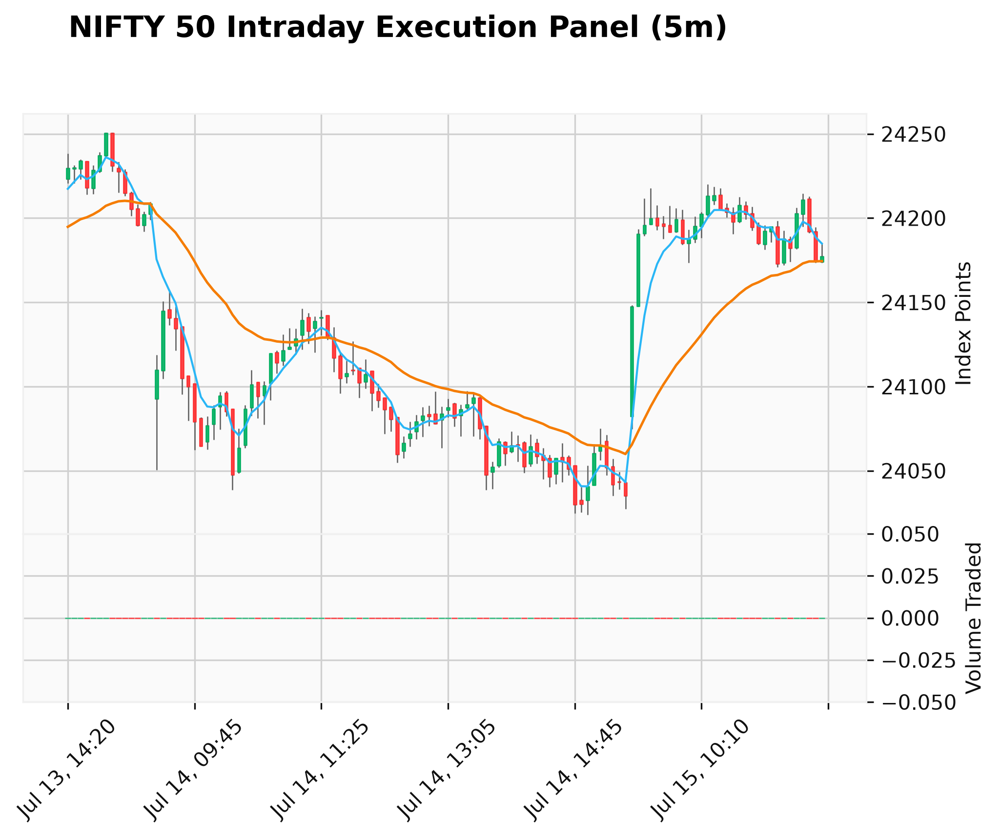

# NIFTY 50 Intraday Quant & Strategy Engine

[](https://github.com/maheshultimatum/Trend-Predictor/actions/workflows/pipeline.yml)


This pipeline automates an intraday technical framework running a 31 & 5 EMA strategy verified by rolling volume checks and linear model parameters.

---

## Core Execution Status
- Last Engine Run: 2026-07-15 06:19:17 UTC
- NIFTY 50 Current Index: 24,177.20
- Model Target Prediction (Next 5-Min): 24,176.17
- Machine Learning Bias: **BEARISH (DOWN)**

## 31 & 5 EMA Execution Signals
- Trend Rule (Price vs 31 EMA): **UPTREND**
- Ribbon Alignment (5 EMA vs 31 EMA): **BULLISH (5 EMA > 31 EMA)**
- Volume Rule (Current vs Past 5 Candles): **NORMAL / LOW**
- Algorithmic Output: **NO SIGNAL / HOLD (Awaiting execution setup)**

### Secondary Micro Metrics
- RSI (14-Period): 49.51
- Fast Exponential Moving Average (5 EMA): 24,184.88
- Slow Exponential Moving Average (31 EMA): 24,174.48

### Live Intraday Chart Architecture


---

## Technical Parameters

```text
Timeframe: 5-Minute Candle Bars
Primary Overlays: 5 EMA (Blue Track), 31 EMA (Orange Track)
Secondary Indicators: Underlaid Volume Bars
```
